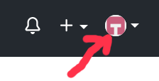
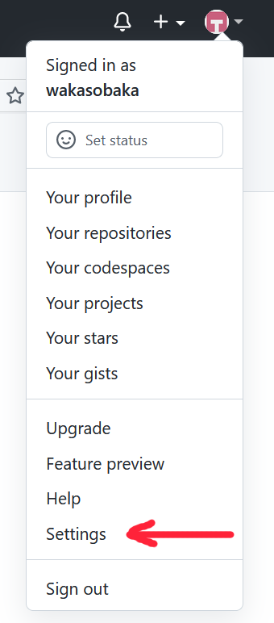
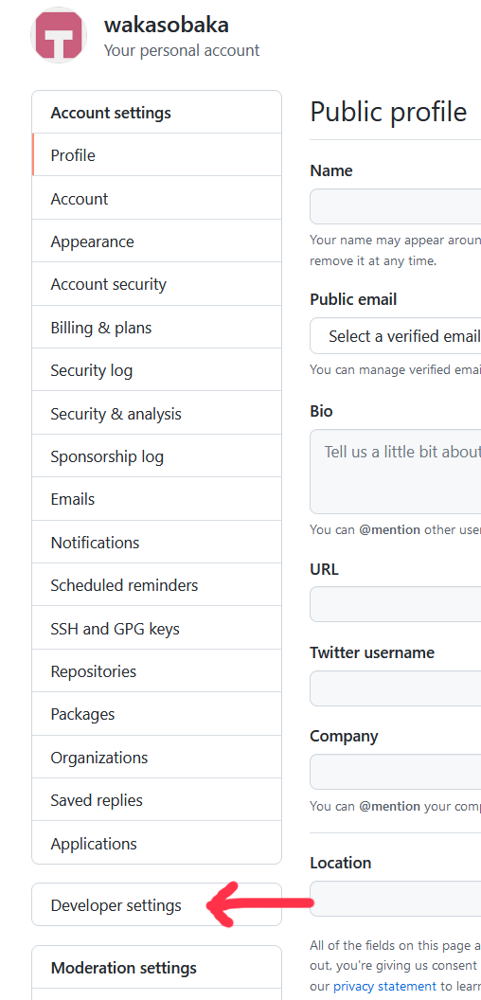
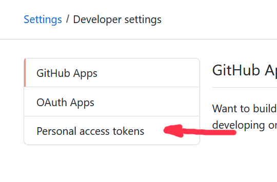
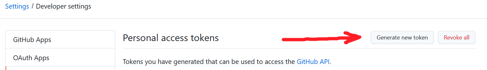
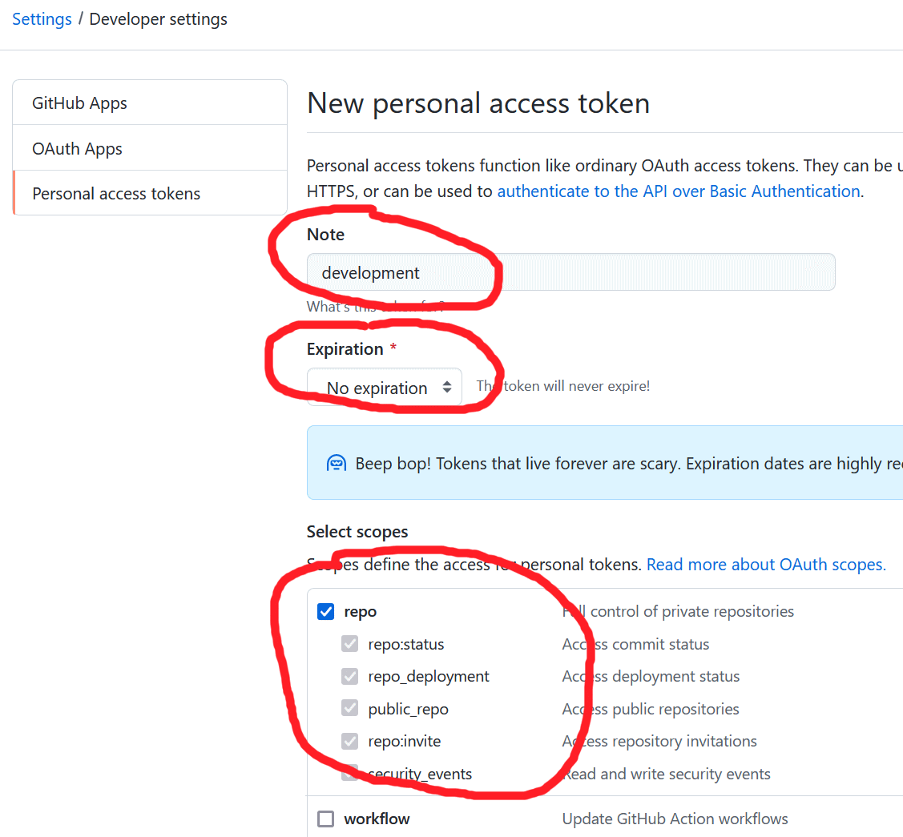
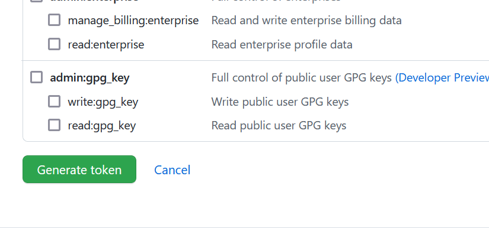
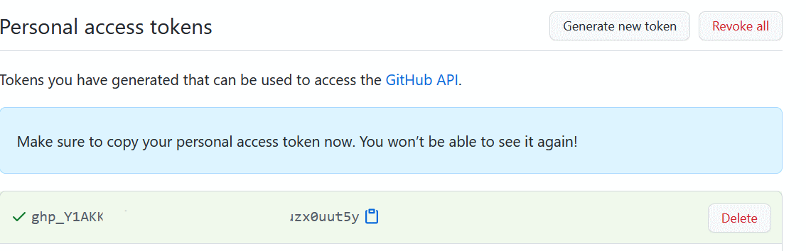

# Работа с github.com

## Вход на сайт github.com
Для авторизации на сайте github.com необходимо ввести:
1. Свою почту
2. Пароль

## Personal Access Token
Для работы с локальным репозиторием github на своем компьютере необходимо знать:
1. Имя пользователя. Это почтовый адрес
2. Пароль. Но это не тот же самый пароль, что используется для входа на сайт. Это Personal Access Token.

Для получения Personal Access Token необходимо:
1. Зайти на сайт github.com
2. Нажать на иконку пользователя в верхнем правом углу.  

3. Должно появиться следующее меню. В нем нужно нажать Settings  

4. Должно появиться следующее меню. В нем нужно нажать Developer settings  

5. Появится следующее меню. В не нужно нажать Personal access tokens

6. Далее нужно нажать на Generate new token

7. Появится раздел для создания нового токена

8. В это разделе необходимо заполнить следующие поля
* Название токена Note: development (можно любое название)
* Время, когда токен устареет. Expiration: No expiration
* Права доступа для токена. Отметить repo. Других пунктов можно не отмечать.
9. Далее нужно опуститься вниз страницы и на нажать на зеленую кнопку Generate token

10. Github.com сгенерирует новый токен. Его нужно сохранить для последующей работы в Git

# Работа с Git

git config --global credential.helper store