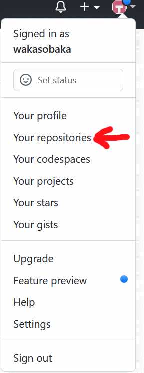

## Github: Создание нового репозитория

Для создания нового репозитория необходимо:
1. Зайти на сайт github.com
2. Нажать на иконку пользователя в верхнем правом углу.  

2. Нажать Your repositories (Ваши репозитории)  

3. Нажать Your repositories (Ваши репозитории)  

