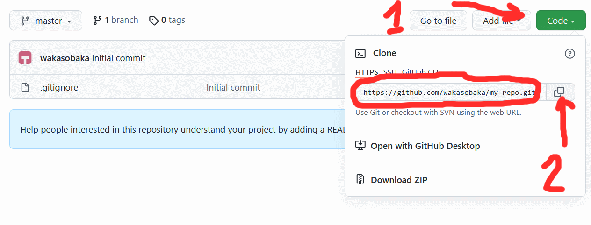

## Github: Создание нового репозитория

Для создания нового репозитория необходимо:
1. Зайти на сайт github.com
2. Нажать на иконку пользователя в верхнем правом углу.  

2. Нажать Your repositories (Ваши репозитории)  

3. Нажать Your repositories (Ваши репозитории)  

4. Создать новый репозиторий  
* Заполнить Repository name (имя репозитория)
* Заполнить Description (описание репозитория)
* Выбрать будет ли репозиторий публичным (Public) или закрытым (Private)
* Выбрать файл .gitignore Julia. Это такая настройка git, которая позволяет игнорировать временные файлы среды Julia.
* Нажать Create repository (Создать репозиторий)

5. Скопировать полный путь к репозиторию для дальнейшей работы с ним  
* Нажать на кнопку Code
* Скопировать подный путь репозитория в буфер обмена

